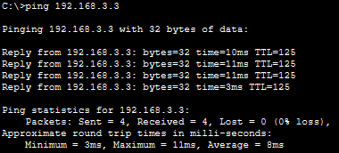

# LAB1. 

#### Part 1. 

###### Step 1. 

All packets have been sent and received.

###### Step 2. 

###### Step 3-4-5-6.

#### Part 2. 

###### Step 1. 

###### Step 2.3.4.5

#### Part 3. 

###### Step 1. 

We can see that the number of packets encapsulated, encrypted, decapsulated, and decrypted are all set to 0.

###### Step 2.

###### Step 3.

###### Step 4.

###### Step 5.

###### Step 6.

